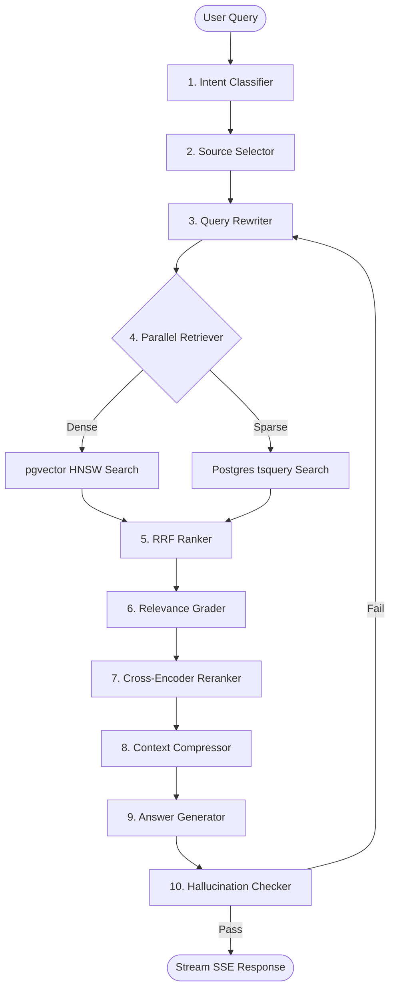

# NexusIQ — Enterprise Knowledge Agent & Multi-Source RAG Platform

NexusIQ is a production-grade, high-performance Enterprise Knowledge Retrieval Agent designed to bridge the gap between siloed corporate communication and documentation platforms. The system ingests, structures, indexes, and queries data across **Confluence, Notion, Slack, Jira, Google Drive, SharePoint, and PDFs**, serving answers in **under 2 seconds** via a unified, real-time streaming interface.

---

## 🚀 Key Technical Highlights (For CV / Portfolio)

- **Agentic LangGraph Orchestration**: Architected a 10-node agentic retrieval pipeline with a retry loop, fallback routes, and hallucination checker nodes to guarantee fact-aligned answers.
- **Hybrid PostgreSQL Search Engine**: Integrated dense vector search (via `pgvector` HNSW indexes) and sparse BM25-approximate search (using Postgres GIN trigram/full-text search).
- **Reciprocal Rank Fusion (RRF) Ranker**: Implemented a mathematical merge layer ($k=60$) combining dense and sparse list rankings, optimizing retrieval precision prior to LLM generation.
- **Hierarchical Parent/Child Chunking**: Developed an advanced chunking strategy where child chunks (256-token, contextually enriched with titles/authors/dates) are used for search, and parent chunks (1024-token) are injected into the generator context for superior coherence.
- **High-Performance Ingestion Pipeline**: Created an end-to-end parallel ingestion system with hash-based deduplication, batch embedding generation (using NOMIC-API with local BGE/MiniLM fallbacks), and transactional upserts.
- **Enterprise-Grade Logging & Analytics**: Engineered tables for full audit logs, query latency monitoring, semantic cache telemetry, and human-in-the-loop escalation queues.

---

## 📐 Architecture & Agent Pipeline

The core retrieval and answer generation pipeline is built using **FastAPI** and **LangGraph**, dividing query processing into isolated, highly optimized stages:



### 10-Node Pipeline Breakdown

| Node | Model / Technology | Function | Latency Target |
| :--- | :--- | :--- | :--- |
| **1. Intent Agent** | `llama-3.1-8b-instant` | Classifies query type (factual, procedural, comparison, multi-hop) and complexity. | <150ms |
| **2. Source Selector** | `llama-3.1-8b-instant` | Maps query intent against connected databases, choosing relevant sources. | <150ms |
| **3. Query Rewriter** | `llama-3.1-70b-versatile` | Optimizes and rewrites queries for better keyword and vector matching. | <300ms |
| **4. Parallel Retriever** | `PostgreSQL + pgvector` | Conducts dense & sparse search concurrently in database worker threads. | <400ms |
| **5. RRF Ranker** | `Python Math Utility` | Blends vector and BM25 scores using Reciprocal Rank Fusion ($k=60$). | <50ms |
| **6. Relevance Grader** | `llama-3.1-8b-instant` | Filters out non-relevant or noisy chunks that might cause hallucination. | <200ms |
| **7. Cross-Encoder** | `ms-marco-MiniLM-L-6-v2` | Deep-reranks remaining chunks using a local cross-encoder model on CPU. | <150ms |
| **8. Context Compressor** | `SQL parent-chunk fetch` | Pulls the parent 1024-token chunk text for selected 256-token child hits. | <100ms |
| **9. Answer Generator** | `llama-3.3-70b-versatile` | Synthesizes final response matching the retrieved context. | <600ms |
| **10. Hallucination Guard**| `llama-3.1-70b-versatile` | Performs self-reflection checking generated claims against context documents. | <400ms |

---

## 🛠️ Tech Stack

### Backend
- **Framework**: FastAPI (Asynchronous lifespan handlers, GZip compression, SSE streaming)
- **Database**: PostgreSQL (pgvector + GIN indexes for fuzzy trigrams and Full-Text Search)
- **Agent Pipeline**: LangGraph & LangChain Community
- **Models**: Groq Cloud API (Llama 3.1 & 3.3) for agent logic; SentenceTransformers (all-MiniLM-L6-v2) for local CPU-based embeddings and reranking
- **Cache**: Redis (Semantic cache with cosine similarity matching threshold = 0.95; fallback in-memory cache)
- **ORM / Driver**: SQLAlchemy 2.0 (Asyncio) + asyncpg

### Frontend
- **Framework**: Next.js 14 (App Router, Tailwind CSS, TypeScript)
- **Real-Time Stream**: EventSource SSE streaming client
- **Icons / Design**: Lucide React + CSS Glassmorphism effects

---

## 📂 Project Structure

```
EnterpriseKnowledgeAgent/
├── backend/
│   ├── agents/               # LangGraph 10-node agent pipeline nodes and states
│   ├── cache/                # Redis semantic and exact cache managers
│   ├── ingestion/            # Sync service and source connectors
│   │   ├── connectors/       # Confluence, Jira, Notion, Slack, Drive, SharePoint, PDF, URL
│   │   ├── chunker.py        # Hierarchical child/parent text chunking
│   │   └── pipeline.py       # End-to-end ingestion and vector creation
│   ├── retrieval/            # Vector embeddings and RRF hybrid search logic
│   ├── migrations/           # SQL schema migrations (initial tables and seed scripts)
│   ├── scripts/              # Database seeding and inspection tools
│   ├── routers/              # FastAPI endpoints (query, sources, documents, feedback, admin)
│   ├── main.py               # Application entry point and startup handlers
│   └── requirements.txt      # Python dependencies
├── frontend/
│   ├── app/                  # Next.js app pages (chat, sources, documents, analytics)
│   ├── components/           # Chat interface, source cards, sidebar layouts
│   └── package.json          # Node dependencies
└── docker-compose.yml        # Docker compose configuration
```

---

## 🧪 Database Seeding & Mock Connector Framework

To enable comprehensive end-to-end testing without hooking up live enterprise credentials, the ingestion connectors support a development mock mode.

### Running the Seed Script
You can seed a database with **20 highly realistic, interconnected documents and 41 chunks** across all 8 sources by running:

```bash
cd backend
$env:PYTHONPATH="."
.venv\Scripts\python.exe scripts/seed_complete_kb.py
```

### Seeding Summary Output
```
==================================================
Source: Corporate Confluence Space     | Type: confluence   | Docs: 3
Source: Shared Google Drive Folder     | Type: google_drive | Docs: 2
Source: Jira Workspace (NEX)           | Type: jira         | Docs: 3
Source: Company Notion Workspace       | Type: notion       | Docs: 3
Source: Company PDF Library            | Type: pdf          | Docs: 3
Source: SharePoint Document Library    | Type: sharepoint   | Docs: 2
Source: Engineering Slack Channels     | Type: slack        | Docs: 2
Source: Internal Wiki URLs             | Type: url          | Docs: 2
--------------------------------------------------
Total Documents in DB: 20
Total Chunks in DB:    41
==================================================
```

---

## ⚙️ Quick Start (Local Setup)

### 1. Database Configuration
Create a PostgreSQL database named `nexusiq` and run the migrations:
```bash
psql -U postgres -c "CREATE DATABASE nexusiq;"
psql -U postgres -d nexusiq -f backend/migrations/001_initial.sql
psql -U postgres -d nexusiq -f backend/migrations/002_seed_sources.sql
```

### 2. Backend Startup
Set up the python virtual environment, configure your `.env` (requires `GROQ_API_KEY`), and start the uvicorn API server:
```bash
cd backend
python -m venv .venv
.venv\Scripts\activate
pip install -r requirements.txt
copy ..\.env.example .env

# Start server forcing UTF-8 encoding (prevents CP1252 logging issues under Windows)
$env:PYTHONIOENCODING="utf-8"
$env:PYTHONPATH="."
.venv\Scripts\uvicorn.exe main:app --reload --port 8000
```
- **FastAPI docs:** [http://localhost:8000/docs](http://localhost:8000/docs)
- **Health check:** [http://localhost:8000/health](http://localhost:8000/health)

### 3. Frontend Startup
Open a new terminal and run Next.js:
```bash
cd frontend
npm install
npm run dev
```
- **Next.js app:** [http://localhost:3000](http://localhost:3000)

---

## 🔍 Recommended Test Queries (RAG Evaluation Cases)

### Multi-Hop & Cross-Source Queries
- **Slack & Jira Connection**: *"What HNSW settings did Dave recommend in Slack, and what is the progress of the corresponding Jira ticket NEX-101?"*
- **Confluence & SharePoint Comparison**: *"Compare the VP approval rules for remote work (in Confluence) with the travel policy flight class rules (in SharePoint)."*
- **Three-Source Security Review**: *"Draft a summary of all security decisions made across Confluence PRD, Notion meeting notes, and SharePoint security SOP."*

### Single-Source Verification Queries
- **Confluence**: *"What are the 10 nodes of the NexusIQ LangGraph architecture?"*
- **Notion**: *"What is the primary heading font and accent color defined in the Brand Guidelines?"*
- **Jira**: *"What is the status of the Jira ticket NEX-101, and who is the assignee?"*
- **Slack**: *"What was discussed in Slack about SQLAlchemy casting issues and security audit approval?"*
- **Google Drive**: *"What is the monthly budget allocated for RDS PostgreSQL and Groq LLM API costs?"*
- **SharePoint**: *"How does the Security SOP classify Sev-1 incidents, and where should they be reported?"*
- **PDF**: *"What is the parental leave duration for primary and secondary caregivers?"*
- **URL**: *"What pytest command should be run locally inside the backend folder?"*
