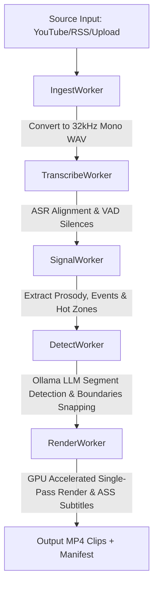

# 🎬 PodClips: High-Performance Full-Stack AI Podcast & Video Shorts Generator

PodClips is a professional, production-grade web application and pipeline designed to automate the extraction of high-engagement, vertical short-form clips (TikTok, Instagram Reels, YouTube Shorts) from long-form video and audio files. 

Featuring a modern **Glassmorphic Dark Theme Dashboard**, the system implements a robust local AI-driven pipeline that coordinates ingestion, multi-engine transcription with VAD alignments, advanced digital signal processing (DSP) for acoustic excitement profiling, LLM-based semantic clip selection with custom JSON repair, and hardware-accelerated single-pass rendering with professional two-line karaoke captions.

---

## 🏗 System Architecture & Directory Structure

The project follows a modular, worker-based orchestrator design pattern with a separate asynchronous FastAPI web application serving a vanilla ES6/CSS3 single-page dashboard.

```
podclips/
├── app.py                      # FastAPI Web Application, API Endpoints, Asynchronous Worker Queue
├── config.yaml                 # Central YAML Configuration File (Model selections, thresholds, limits)
├── requirements.txt            # Python Dependencies List
├── config/
│   └── settings.py             # Config parser, Environment Variable overrides, Default schemas
├── pipeline/
│   └── orchestrator.py         # Pipeline Job runner (sequentially calls Ingest → Transcribe → Signals → Detect → Render)
├── utils/
│   └── logger.py               # Structured thread-safe colored logging utility
├── static/                     # Frontend SPA Client Assets
│   ├── index.html              # HTML5 Semantic layout, sidebar, forms, grid components
│   ├── style.css               # Glassmorphic dark styling, responsive CSS grids, CSS variables
│   └── app.js                  # Frontend SPA Logic, file uploads, AJAX polling, video playback controls
├── workers/                    # Pipeline Worker Micro-Services
│   ├── ingest.py               # YouTube, RSS, and Upload Handler; FFmpeg audio demux & extraction
│   ├── transcribe.py           # WhisperX / faster-whisper core alignment, low-confidence filter, VAD silences
│   ├── signals.py              # DSP Prosody, ZCR Pitch estimation, energy spikes, YAMNet event mapping, K-Means clustering
│   ├── detect.py               # Ollama LLM integration, JSON format streaming, context sizing, overlap chunking, JSON repair
│   └── render.py               # FFmpeg single-pass renderer, GPU detection, face crop tracking, ASS karaoke subtitle compiler
├── output/                     # Final output directory (Manifests, MP4 clips, ASS logs)
├── uploads/                    # Temporary staging directory for local file uploads
└── temp/                       # Temporary scratchpad (WAVs, uncropped cuts, intermediate ASS files)
```

---

## 🔄 The Pipeline Flow



The orchestrator (`pipeline/orchestrator.py`) runs the pipeline sequentially for a `PipelineJob`. It manages job states: `queued` ➔ `ingesting` ➔ `transcribing` ➔ `analyzing` ➔ `detecting` ➔ `rendering` ➔ `done`/`error`, saving progress dynamically to a `{job_id}_manifest.json` file.

---

## 🛠 Detailed Worker Breakdown & Core Algorithms

### 1. Ingest Worker (`workers/ingest.py`)
Responsible for downloading and normalizing external feeds or processing local media.
*   **Multi-Source Ingestion**: Handles raw YouTube URLs, RSS podcast feeds, and local uploads up to 2GB.
*   **yt-dlp Engine**: Downloads YouTube videos using a progress hook, integrates SponsorBlock to skip ads/intros, and features exponential backoff retries. If video download fails, it falls back to an audio-only stream.
*   **Podcast RSS Parser**: Parses XML feeds, lists recent episodes, extracts the audio enclosure URL, and streams it chunk-by-chunk to disk using `aiohttp`.
*   **Accurate Stream Probing**: Uses `ffprobe` to query stream indices and metadata. It detects language tags to find the English audio track index and maps it explicitly (`-map 0:eng_index`) during extraction.
*   **Audio Normalization**: Extracts audio tracks and converts them into **32kHz Mono 16-bit PCM WAV** files (`pcm_s16le`, `-ar 32000`, `-ac 1`). This sample rate provides a clean, standardized input for the transcription and DSP analyzers.

### 2. Transcription Worker (`workers/transcribe.py`)
Performs automatic speech recognition (ASR) to extract word-level timestamps and speaker identities.
*   **Dual-Engine Architecture**: Operates on `WhisperX` (PyTorch) for fast batch-16 transcribing and forced alignment. If `WhisperX` fails or is not present, it drops back to `faster_whisper`, and further to a python subprocess executing the Whisper CLI.
*   **Beam Search & VAD Tuning**: Runs `faster_whisper` with a tuned beam size of 3, `best_of=3`, and active Voice Activity Detection (VAD) filter (`min_silence_duration_ms=500`) to exclude background noise.
*   **Confidence Filtering (Hallucination Control)**: Filters out words with an ASR probability under 0.4. When words are dropped, the worker dynamically reconstructs the segment text and adjusts the segment's starting and ending timestamps.
*   **Silence & VAD Boundary Extraction**: Computes silent periods (gaps between contiguous segments $\ge 0.3$s). These boundaries are exposed as timestamps for the clipping and rendering engines to guarantee cuts land on natural pauses.
*   **Language Fallback**: Features automatic language detection. If the detected language probability is under 0.8, the system automatically falls back to English to prevent transcription errors.
*   **Speaker Diarization**: Integrates PyAnnote.audio via HuggingFace token validation to label speakers (e.g. `Speaker_A`, `Speaker_B`).

### 3. Signal Extraction Worker (`workers/signals.py`)
Applies Digital Signal Processing (DSP) and Machine Learning to model the audio's emotional energy.
*   **Prosody Feature Extraction**: Loads the audio via `librosa` and extracts:
    *   **RMS Energy**: Root-mean-square amplitude, calculated per-segment.
    *   **Pitch Estimation (F0)**: Approximates vocal pitch using Zero-Crossing Rate (ZCR) calculations filtered to the human speech range (50-500Hz). This proxy method is **10x faster** than traditional `librosa.pyin` autocovariance tracking.
    *   **Spectral Centroid**: Models the "brightness" or high-frequency distribution of the voice.
    *   **Speech Rate (WPM)**: Words-per-minute rate computed from word counts and segment durations.
*   **Voice Activity Pauses**: Maps silence durations after each segment.
*   **Energy Spike Detection**: Compares segment RMS values against a local moving average window (10 surrounding segments) and a global Z-score threshold. Segments with $\text{RMS} > 1.8 \times \text{local mean}$ or a global Z-score $> 1.5$ are flagged as `energy_spike=True`.
*   **Acoustic Event Detection**:
    *   **YAMNet (TensorFlow Hub)**: Classifies acoustic events, searching for laughing and applause.
    *   **Spectral Heuristics Classifier**: Fallback classifier when TensorFlow is unavailable. It evaluates *spectral flatness* (high for broad noise like applause) and *RMS variance* (laughter has rapid energy bursts) to calculate custom event scores:
        $$\text{applause\_score} = \min(1.0, (\text{flatness} - 0.15) \times 3.0) \quad (\text{if flatness} > 0.15)$$
        $$\text{laughter\_score} = \min(1.0, (\text{rms\_variance} - 0.5) \times 0.5) \quad (\text{if variance} > 0.5 \text{ and flatness} < 0.15)$$
*   **Semantic Hot-Zone Clustering**: Normalizes the feature vectors (energy, pitch variance, centroid, speech rate) and clusters segments using **Scikit-Learn K-Means** ($k=3$). Clusters are ordered by excitement level (Calm, Normal, Excited). It calculates a unified `hot_zone_score` representing segment arousal.

### 4. AI Clip Detector (`workers/detect.py`)
Uses LLM reasoning to identify viral highlights and optimizes the clip parameters.
*   **Acoustic Signal Injection**: Merges the transcript with DSP features, mapping tags like `[LAUGH 0.85]`, `[ENERGY_SPIKE]`, `[PITCH_SPIKE 65Hz]`, and `[PAUSE 1.2s]` directly into the LLM prompt.
*   **Structured JSON Output**: Configures the local Ollama LLM (typically `llama3.1:8b`) with `format: "json"` chat parameters and deterministic settings (temperature = 0, `num_ctx = 16384` to prevent prompt truncation) to output a strictly typed JSON list of candidates.
*   **Long-Transcript Chunking**: For inputs longer than 10 minutes, the worker splits the transcript into overlapping 10-minute blocks (1-minute overlap), calls the LLM for each chunk, and resolves overlaps by keeping the clip with the higher virality score.
*   **Robust Multi-Stage JSON Repair**:
    1.  *Direct Parse*: Evaluates the raw string.
    2.  *Brace Extraction*: Trims markdown code fences and isolates the outermost `{ ... }`.
    3.  *Brace-Counting Repair*: For truncated LLM outputs, it counts open braces/brackets, closes unclosed quotation marks, and appends matching closing symbols.
    4.  *Regex Fallback*: Matches individual clip fields if structural parsing fails.
*   **Snapping & Boundary Adjustments**: Snaps LLM timestamps to the nearest sentence/VAD boundary (within a 2-second tolerance).
*   **Filler Word Filter**: Checks the opening words of each clip. If a clip starts with a weak filler word ("so", "um", "uh", "yeah", "i mean", "like", "you know"), the worker shifts the start time forward by one segment, validating that the remaining duration stays within limits.
*   **Virality Scoring & Acoustic Bonuses**: Computes a weighted score based on hook strength, emotional intensity, completeness, actionability, and story arc, and adds an acoustic bonus based on laughter and energy spikes:
    $$\text{virality\_score} = \sum (\text{LLM\_score}_i \times \text{weight}_i) + \text{acoustic\_bonus}$$
*   **High-Density Fallback Clipper**: If no LLM candidates pass validation, it runs a sliding-window search to locate the segment span with the highest word density, outputting it as a fallback clip.

### 5. Render Worker (`workers/render.py`)
Cuts, reframes, captions, and encodes the final videos.
*   **Concurrent Rendering**: Leverages `asyncio.Semaphore(2)` to limit concurrent FFmpeg processes, preventing CPU starvation or GPU out-of-memory errors.
*   **Hardware Codec Auto-Detection**: Probes available encoders at runtime and tests them by encoding a 0.1-second black frame. It activates **NVIDIA CUDA NVENC** (`h264_nvenc`) on Windows/Linux or **Apple Silicon VideoToolbox** (`h264_videotoolbox`) on macOS, falling back to CPU (`libx264`) if hardware tests fail.
*   **Single-Pass FFmpeg Pipeline**: Combines cutting, cropping, scaling, caption-burning, and watermarking into a single FFmpeg execution:
    *   *Input Seeking*: Places `-ss` after `-i` to force accurate decoding of the target frames, resolving keyframe seeking issues.
    *   *9:16 Reframing*: Extracts a vertical 1080x1920 viewport from horizontal videos using bilinear scaling.
    *   *Smart Face-Tracking (MediaPipe)*: When enabled, it samples frames, runs MediaPipe Face Detection to track the active speaker, smooths the center path using exponential smoothing:
        $$x_t = x_{t-1} + \alpha (x_{\text{detected}} - x_{t-1})$$
        and crops dynamically around the face.
*   **Professional Karaoke Captioning**: Generates Advanced Substation Alpha (ASS) subtitle files:
    *   *Group-by-Sentence*: Groups words into lines based on punctuation, word counts ($\le 6$), or duration ($\le 4$s).
    *   *Dynamic Font Scaling*: Automatically adjusts font sizes based on line length (e.g. $\le 4$ words = 72pt, 5-6 words = 60pt, $>6$ words = 52pt).
    *   *2-Line Rolling Layout*: Renders a semi-transparent black overlay background box behind the text. The top line displays the previous sentence (dimmed to grey), while the bottom line displays the current sentence using `\\kf` centisecond timing to highlight words in yellow left-to-right as they are spoken.
    *   *Safe Zones*: Subtitles are rendered at `MarginV = 460` (pixels from bottom) and watermarks at `MarginV = 220` (pixels from top) to prevent them from being covered by mobile app UI elements.
*   **Audio Waveform Visualization**: For audio-only feeds, it runs FFmpeg's `showwaves` filter to overlay a dynamic cyan and purple waveform (`colors=0x8A2BE2|0x00FFFF`) on a dark background.

---

## 💻 Tech Stack & Core Libraries

*   **Backend API**: FastAPI, Uvicorn, httpx, aiohttp
*   **CLI & System**: Python 3.10+, YAML, FFmpeg & FFprobe, yt-dlp
*   **Machine Learning & Speech**: WhisperX, faster-whisper, PyAnnote (diarization)
*   **Digital Signal Processing**: Librosa, NumPy, TensorFlow Hub (YAMNet)
*   **Computer Vision**: MediaPipe, OpenCV (cv2)
*   **Frontend SPA Dashboard**: Vanilla HTML5, CSS3 Custom Properties (variables), Modern ES6 JavaScript (AJAX polling, XMLHttpUpload for progress tracking, native HTML5 Video APIs)

---

## 🚀 Installation & Local Deployment

### 1. Prerequisites
Install `ffmpeg` and ensure it is available in your system path:
```bash
# Windows (via winget)
winget install FFmpeg

# macOS (via Homebrew)
brew install ffmpeg

# Linux (Debian/Ubuntu)
sudo apt install ffmpeg
```

Install and run **Ollama** locally, then pull the target LLM:
```bash
# Pull the default recommended model
ollama pull llama3.1:8b
```

### 2. Python Environment Setup
Clone the repository and install the dependencies:
```bash
# Create virtual environment
python -m venv .venv
source .venv/bin/activate  # On Windows: .venv\Scripts\activate

# Install requirements
pip install -r requirements.txt
```

### 3. Running the Server
Start the FastAPI server:
```bash
python app.py
```
Open [http://127.0.0.1:8000](http://127.0.0.1:8000) in your browser to access the interactive web dashboard.

---

## 🏆 Key Engineering Achievements (CV Highlights)

*   **Optimized Render Pipelines**: Replaced multi-stage cut-and-re-encode operations with a unified, single-pass FFmpeg filter graph. This resolved frame-accurate seeking bugs and improved rendering speed.
*   **Hardware Acceleration Auto-Probing**: Designed a testing module that verifies CUDA and macOS hardware encoders before selecting a codec, preventing crashes from unsupported drivers.
*   **10x Faster Pitch Proxy**: Used Zero-Crossing Rate algorithms to estimate pitch variance instead of traditional harmonic extraction models, significantly reducing CPU processing times.
*   **Fault-Tolerant JSON Parsing**: Implemented a multi-stage parser with a brace-counting repair system to clean up and extract structured clip data from truncated or malformed LLM outputs.
*   **High-Density Segment Slicer**: Built an automated fallback algorithm that analyzes word counts to extract high-density segments if LLM calls fail.
