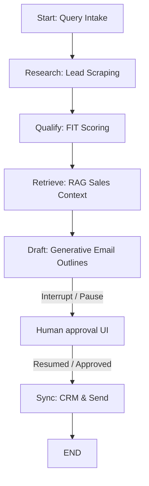

# NexusSDR – Production-Grade AI Sales Development Representative (SDR)

NexusSDR is an autonomous B2B Sales Automation Agent and outreach engine designed to run end-to-end campaigns. Powered by a deterministic state-machine workflow (LangGraph) and LLMs (Groq / Llama-3), it parses natural language search criteria, discovers and qualifies prospects, performs context-aware sales knowledge retrieval (RAG), drafts personalized 4-stage cold email sequences, and uses a human-in-the-loop approval mechanism before final synchronization.

This system is built as a production-grade monorepo containing a FastAPI backend API, a Next.js frontend control dashboard, and background workers.

---

## 🚀 Key Highlights & CV Bullet Points

If you are adding this project to your CV, here are highly impactful, professional bullet points describing your contributions:

*   **Designed & Developed a Multi-Agent Sales Pipeline**: Engineered an autonomous B2B SDR agent using **LangGraph**, **FastAPI**, and **Next.js** to coordinate lead discovery, qualification scoring, sales context retrieval, and email drafting.
*   **Implemented Deterministic State-Machine Workflows**: Modeled the outreach pipeline as a directed graph with state checkpoints, utilizing **LangGraph Interrupts** (`interrupt_before`) to freeze graph state for human review and edit, ensuring 100% brand safety before email synchronization.
*   **Architected a Hybrid RAG Retrieval Engine**: Developed a context-enrichment system combining vector similarity search (**ChromaDB** / **pgvector**) and full-text search, employing **Reciprocal Rank Fusion (RRF)** to retrieve and merge relevant case studies and playbooks.
*   **Optimized LLM Execution & Cost Efficiency**: Configured a dual-model LLM framework using **ChatGroq**; routed lightweight tasks (query parsing and fit-scoring) to a fast model (**Llama-3.1-8B-Instant**) and high-quality generation (personalized emails) to a smart model (**Llama-3.3-70B-Versatile**).
*   **Built Real-Time Backend Observability**: Implemented **Server-Sent Events (SSE)** in FastAPI to stream execution node transitions and live scraping status to a Next.js dashboard, increasing UI responsiveness and transparency.
*   **Engineered a Production-Ready Monorepo Architecture**: Structured code into modular sub-apps (`apps/api`, `apps/web`, `apps/worker`) and shared internal libraries (`packages/database` with SQLAlchemy ORM and Alembic migrations, `packages/schemas` for typed state models).

---

## 🏗️ System Architecture & Code Structure

The repository is structured as a Python/JS monorepo to maintain clean separation of concerns:

```text
├── apps/
│   ├── api/                   # FastAPI Backend Server
│   │   ├── agent/             # LangGraph state machine workflow (graph.py, nodes.py)
│   │   ├── retrieval/         # Hybrid Search & RAG logic (hybrid_search.py)
│   │   ├── tests/             # Pytest suite (graph & API endpoint assertions)
│   │   ├── main.py            # API routes, SSE stream, background tasks
│   │   └── config.py          # Environment settings (Pydantic-Settings)
│   ├── web/                   # Next.js App Router Frontend Dashboard
│   │   ├── app/               # UI Pages (Campaigns, Queue, Leads, Analytics)
│   │   └── components/        # Reusable dashboard design tokens
│   └── worker/                # Background scraping & task runner (Celery config)
├── packages/
│   ├── database/              # Shared Database ORM models (SQLAlchemy) & Migrations
│   └── schemas/               # Shared Pydantic data schemas & LangGraph state definitions
├── infra/                     # Infrastructure files (Docker Compose, API/Web Dockerfiles)
├── run_local.ps1              # Local dev launcher script (Windows PowerShell)
└── run_local.sh               # Local dev launcher script (Unix Bash)
```

---

## 🔄 The LangGraph Workflow (State Machine)

The core SDR pipeline is modeled as a state machine (`AgentState`) using a `StateGraph` that manages variables across nodes:



1.  **Intake Node**: Takes a natural language query (e.g. *"Find FinTech startups in NY with 10-50 employees"*) and uses a fast LLM to parse it into structured JSON matching target ICP parameters (industry, employees, location, and keywords).
2.  **Research Node**: Simulates/integrates B2B data providers (like Apollo or LinkedIn) to find matching companies, scraping web context and public details about the accounts.
3.  **Qualify Node**: Evaluates each lead against target criteria. Utilizes the LLM to output a fit score between 0 and 100 with structured reasoning, adding transparency to the pipeline.
4.  **Retrieve Node (RAG)**: Formulates search queries against the database of internal marketing collateral, playbooks, and case studies to select context for personalization.
5.  **Draft Node**: Feeds lead data, company research, and retrieved RAG context into the larger model (**Llama-3.3-70B**) using a highly structured system prompt. It outputs a 4-part personalized outreach sequence (Subject, Body, Follow-up 1, Follow-up 2, and Breakup email) as valid JSON.
6.  **Human Approval (Interrupt)**: Before synchronization, the graph pauses. The execution state is checkpointed in memory or database. The backend exposes this state through the `/api/queue` endpoint to the Next.js frontend, allowing the user to review, edit, or reject the generated drafts.
7.  **Sync Node**: Once approved, the graph resumes execution via the `/api/campaign/approve` endpoint, saving drafts and transitioning leads to a synced status (ready to connect to CRMs like HubSpot or Salesforce and SMTP clients).

---

## 🔍 RAG & Search Retrieval Strategy

To make cold outreach feel highly tailored rather than generic, the system retrieves local case studies, competitor sheets, and sales playbooks.

*   **Dual Search (Hybrid Search)**: In production, the system joins vector similarity (Cosine distance on embeddings generated from playbooks) and full-text search (SQL Server/Postgres `TSVector`) against a `documents` schema.
*   **Reciprocal Rank Fusion (RRF)**: Merges search results by calculating reciprocal rank scores:
    $$RRF(d) = \sum_{m \in M} \frac{1}{k + r_m(d)}$$
    This ensures that documents appearing high in *both* keyword and vector searches are ranked highest, creating highly relevant context chunks.
*   **ChromaDB Local Path**: For local development, the backend switches to an automatic, docker-less **ChromaDB Persistent Client** (`chroma_db/`), ensuring developers can test retrieval capabilities without spinning up a heavy containerized database.

---

## 📊 Local Dev vs. Production Architecture

The stack is optimized for low-friction local development while maintaining hooks for enterprise deployment:

| Component | Local Development Stack | Production-Grade Stack |
| :--- | :--- | :--- |
| **Database** | SQLite (`sales_db.sqlite`) | PostgreSQL |
| **Vector Store** | Local ChromaDB Client | PostgreSQL (`pgvector`) |
| **Task Queue** | Fast API BackgroundTasks | Celery + Redis |
| **Agent State** | In-Memory Checkpointer (`MemorySaver`) | Postgres-backed Checkpointer (`AsyncPostgresSaver`) |
| **LLM Inference** | ChatGroq (Free Tier / Mocks) | Groq Enterprise / Direct LLM API Keys |
| **Integrations** | Sandbox Mocks | Apollo / HubSpot / Salesforce Live APIs |

---

## 💻 Tech Stack Summary

*   **Backend Framework**: FastAPI (Asynchronous Python ASGI, Pydantic configuration, SSE Streams)
*   **Orchestration**: LangGraph, LangChain Core
*   **Database & ORM**: SQLAlchemy ORM, Alembic Migrations, SQLite / PostgreSQL
*   **Vector Database**: ChromaDB (Dev), pgvector (Prod)
*   **Inference API**: Groq Cloud SDK (Llama 3.1 8B, Llama 3.3 70B)
*   **Frontend Library**: Next.js (App Router, Tailwind CSS, TypeScript, EventSource Client for SSE)
*   **Tests**: Pytest, Pytest-Asyncio, FastAPI TestClient

---

## ⚙️ How to Run Locally

### 1. Requirements
*   Python 3.11+
*   Node.js 18+ and npm

### 2. Environment Configuration
Create a `.env` file in the root directory (you can copy `.env.example` as a template):
```bash
GROQ_API_KEY=your_groq_api_key
DATABASE_URL=sqlite:///./sales_db.sqlite
CORS_ORIGINS=http://localhost:3000
```
*(If no GROQ_API_KEY is supplied, the application automatically boots in **Mock Mode**, using sandbox endpoints and mock states so you can explore the entire Next.js UI features without API costs!)*

### 3. Startup Script
A convenient script handles dependencies installation and sets up the server stacks:

*   **Windows (PowerShell)**:
    ```powershell
    .\run_local.ps1
    ```
*   **Unix (Bash)**:
    ```bash
    chmod +x run_local.sh
    ./run_local.sh
    ```

The script will automatically:
1. Initialize the Python virtual environment (`.venv`) and install pip packages.
2. Spin up the FastAPI backend on `http://localhost:8000`.
3. Install npm packages in `apps/web` and boot the Next.js development server on `http://localhost:3000`.
